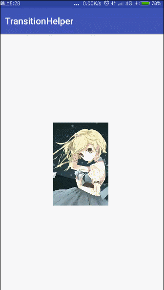
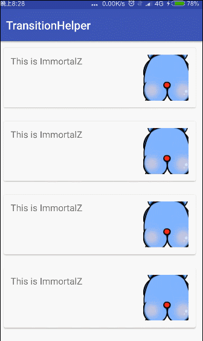
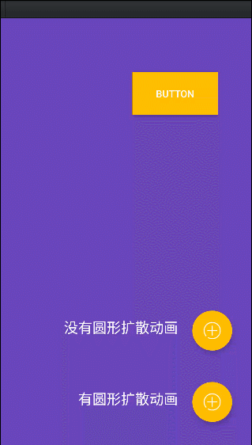

# TransitionHelper

这是一个简单的Activity转场动画 工具类

API compatible with <b>Android 2.2+</b>


## 截图






## 怎么使用

>更多使用，请查看demo

**1.首先在跳转的Activity中**
> TransitionsHeleper.startActivity(this, ImageDetailActivity.class, view, load);

**2. 在目标Activity/Fragment中的onCreate中**
```
    TransitionsHeleper.build(this)
                .setShowMethod(new ColorShowMethod(R.color.bg_teal_light, R.color.bg_purple) {
                    @Override
                    public void loadPlaceholder(InfoBean bean, ImageView placeholder) {
                        Glide.with(ImageDetailActivity.this)
                                .load(bean.getLoad())
                                .centerCrop()
                                .into(placeholder);
                    }

                    @Override
                    public void loadTargetView(InfoBean bean, View targetView) {
                        Glide.with(ImageDetailActivity.this)
                                .load(bean.getLoad())
                                .centerCrop()
                                .into((ImageView) targetView);
                        tv.setText("immortalz");
                    }
                })
                .setExposeColor(getResources().getColor(R.color.bg_purple))
                .intoTargetView(ivDetail)
                .show();
```

**3. 为了避免内存泄漏，及时回收相关变量，在onPause中**
```
    @Override
    protected void onPause() {
        super.onPause();
        TransitionsHeleper.onPause(this);
    }
```

## API

| 名字                      | 描述备注      
| ------------------------- | ------- 
| setExposeView              | 支持CirleExposeView，FoldExposeView（你可以通过继承ExposeView来自定义需要的揭露动画）  
| setExposeColor     |    设置揭露动画的颜色，如果不设置就是透明，**推荐设置**
| setShowMethod    |  NoneShowMethod(默认),ColorShowMethod,InflateShowMethod（你可以通过继承ShowMethod来自定义需要的展示过渡方法） 
| intoTargetView  |  通过设置这个，在回调loadTargetView中使用
| setTransitionDuration |  设置转场动画时间
| setTransitionListener           | 设置转场动画监听


## Quick start


**Gradle**

```java
dependencies {
   compile 'me.immortalz:transitionhelper:2.2.1'
}
```

**Maven**

```java
<dependency>
  <groupId>me.immortalz</groupId>
  <artifactId>transitionhelper</artifactId>
  <version>2.2.1</version>
  <type>pom</type>
</dependency>
```

## TODO


- [ ] To better support imageview

- [ ] Add Back animation

- [x] Add Animation Listener

## 更新记录

**v2.2**

- 修复一直不断的打开新的Activity/Fragment导致OOM 
- 添加更多的expose监听

**v2.1**

- Repair caused memory leaks because of misuse
- 添加更多的expose动画 -- FoldExposeView
- 更多细节优化

## End


限于本人能力和精力，还是有许多地方需要完善的，欢迎大家一起来完善！

## Contact

微信公众号


我的微博：

[http://weibo.com/u/1956502961](http://weibo.com/u/1956502961)

## License
```
Copyright (c) 2017 ImmortalZ

Licensed under the Apache License, Version 2.0 (the "License");
you may not use this file except in compliance with the License.
You may obtain a copy of the License at

    http://www.apache.org/licenses/LICENSE-2.0

Unless required by applicable law or agreed to in writing, software
distributed under the License is distributed on an "AS IS" BASIS,
WITHOUT WARRANTIES OR CONDITIONS OF ANY KIND, either express or implied.
See the License for the specific language governing permissions and
limitations under the License.
```